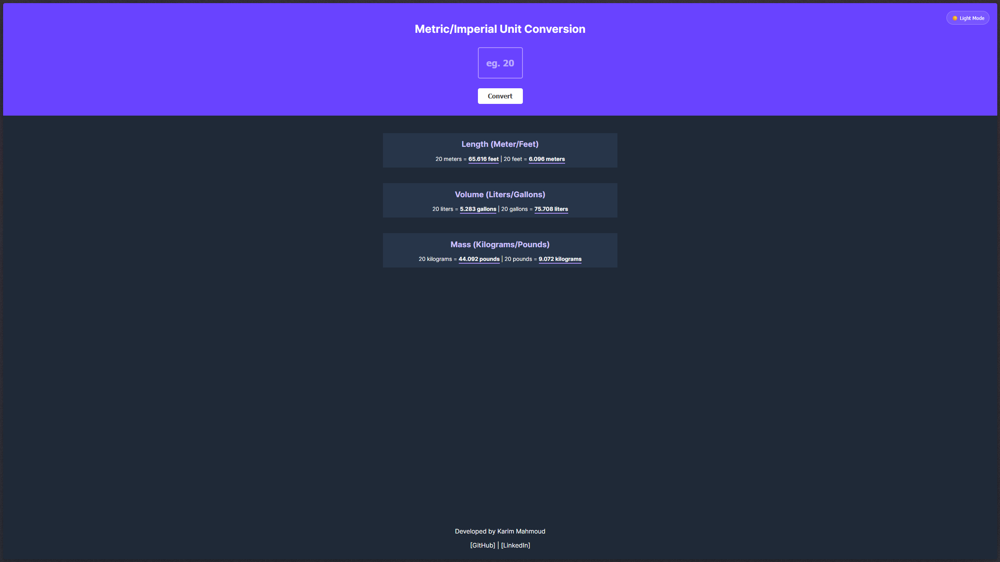
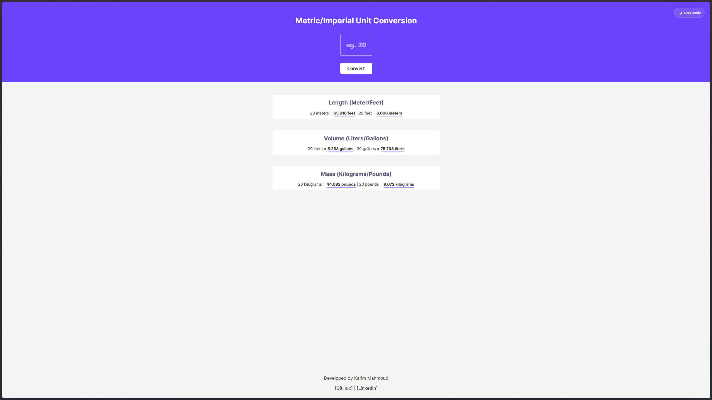

# 📏 Metric/Imperial Unit Converter

A sleek, responsive unit conversion tool that handles length, volume, and mass calculations in real-time. Built as a Scrimba Solo Project with a focus on UI/UX and dark/light mode functionality.

## 🎨 Features
- **Instant Conversion:** Converts meters/feet, liters/gallons, and kilograms/pounds simultaneously.
- **Dynamic Themes:** Fully integrated Light and Dark modes using CSS Variables.
- **Precision Math:** Results are formatted to 3 decimal places for accuracy.
- **Responsive Design:** Optimized for everything from mobile phones to 27-inch monitors.

## 🛠️ Tech Stack
- **HTML5**
- **CSS3** (Custom Properties/Variables, Flexbox, Media Queries)
- **JavaScript** (DOM Manipulation, Template Literals, Event Listeners)

## 🧠 What I Learned
During the development of this project, I deepened my understanding of:
- **CSS Architecture:** Using `:root` variables to create a theme-switching system that is easy to maintain.
- **Mathematical Accuracy:** Handling floating-point numbers in JavaScript and using `.toFixed()` to ensure a clean UI.
- **UX Design:** Implementing a theme toggle with `localStorage` (optional) and using absolute positioning for utility buttons.
- **Viewport Management:** Using `min-height: 100vh` and `max-width` to ensure the app looks professional on ultra-wide screens.

## 📸 Preview
*https://karim-codee.github.io/unit-converter/*
| Dark Mode (Default) | Light Mode |
| :---: | :---: |
|  |  |

---
developed by [Karim Mahmoud Ahmed](www.google.come)
